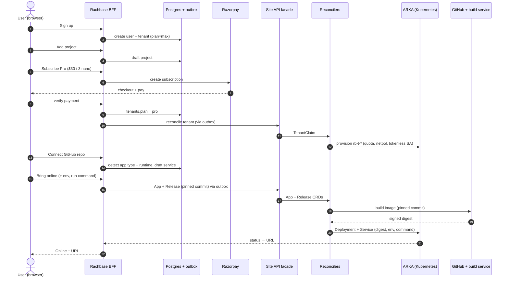
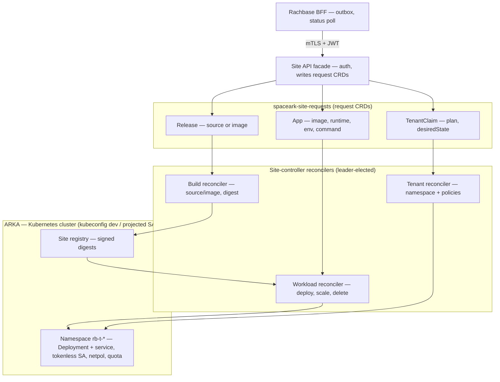
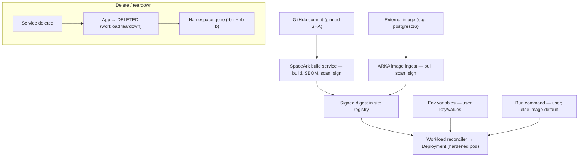

# RachBase ↔ SpaceArk (ARKA) Integration — Authoritative Design

**Date:** 2026-08-17
**Contract:** *SpaceArk PaaS — Partner Control-Plane Developer Guide* (2026-08-19).
**Consolidated single doc.** This absorbs the pricing / unification / resilience / BaaS content from
the former `RachBase_CaaS_ARKA_Design_2026-08-09.md` (now removed) and is the one authoritative
design for the RachBase ↔ SpaceArk integration. Live status checklist in §12.

---

## 0. The three principles (requirements = the contract)

1. **The site-controller is linked locally to ARKA's control plane** — it reconciles through the
   **private** Kubernetes API (`kubernetes.default.svc:443`) at its own site.
2. **The RachBase backend (BFF) connects to the site-controllers** — BFF → site HTTPS API. The BFF
   never connects to Kubernetes.
3. **The site-controller does all ARKA activity** — the BFF holds **no** kubeconfig or cluster
   credential of any kind.

---

## 1. Two partner-built pieces + SpaceArk SRE

| Component | We build | Owns | Must NOT own |
|---|---|---|---|
| **Central BFF** (RachBase backend) | ✅ | Global product, product PostgreSQL (source of truth), transactional **outbox**, user→tenant→home-site resolution, calling the site API | Any Kubernetes credential; placement inside a site |
| **Site-controller — `api` facade** (Internet-reachable) | ✅ | Site API auth, request schema, idempotency, admission/capacity check, **request-CRD** creation, normalized status | Namespace/RBAC/workload writes |
| **Site-controller — `tenant` reconciler** | ✅ | Namespace, quota, limits, ServiceAccounts, NetworkPolicy, approved RoleBindings | Public traffic; app workloads |
| **Site-controller — `workload` reconciler** | ✅ | Managed app-runtime desired state + status | Namespace/RBAC/NetworkPolicy/Secrets |
| **Site-controller — `build` reconciler** | ✅ | Source→image build lifecycle, SBOM/scan/signature, immutable digest | Runtime deploy; tenant security boundary |
| **SpaceArk SRE** | ❌ | Site cluster, edge routing, DNS/TLS, **image registry, build storage**, observability, controller RBAC + releases | Customer membership decisions |

The four site-controller components share one signed image; a startup profile selects which
component(s) run. The default, least-privilege topology **runs each as its own Deployment with its
own ServiceAccount and RBAC** — a defect in the Internet-facing `api` facade must not grant Namespace
or workload mutation rights. A **combined single-process mode** (several profiles in one process) is
also supported for operational simplicity, at a blast-radius cost — see §5.1.

---

## 2. Topology & flow

```
 Customer browser
   → central Node.js BFF
       → product PostgreSQL + transactional outbox          (source of truth)
       → HTTPS site API:  https://api.<site>.paas.arkamicrostacks.com/v1
           → site-controller `api` facade                    (Internet-reachable)
               → site-local request CRDs (spaceark-site-requests)
                   → tenant / workload / build reconcilers
                       → PRIVATE Kubernetes API               (in-cluster only)
                           → runtime, build service, namespaces, policy
```

Only the **k8s API is private**; the **site API is public HTTPS** and the BFF calls it. The static
outbound IP we configured is **required** — SpaceArk allowlists the BFF's egress /32s (see §3 auth).

### 2.1 End-to-end flows (diagrams)

**(a) Signup → running GitHub app** — every layer and its work, from a new user to a live URL.



**(b) Site-controller ↔ ARKA architecture** — one signed image, four profiles; the facade writes
request CRDs and the leader-elected reconcilers converge ARKA.



**(c) Build / ingest, run inputs, and delete** — two image sources resolve to one signed digest;
user env + run command feed the pod (command absent → image default); delete tears the workload down.



---

## 3. Authoritative site API

### 3.1 Endpoint + authentication

Each site's base URL (e.g. `https://api.site1.paas.arkamicrostacks.com/v1`) is routed via that
site's edge gateway to its site-controller API Service — **not** the Kubernetes API. The BFF holds
**many** such URLs in the `sites` registry (see §3.6), keyed by `site_id`; there is no single global
`SITE_API_URL`. Production requires **all** of:

1. TLS 1.2+ with hostname validation + a publicly-trusted server cert;
2. **source /32 allowlisting of every BFF egress/NAT address**;
3. **mTLS** with a partner-specific client certificate at the gateway;
4. a **short-lived signed OAuth2 client-credentials JWT** validated by the API;
5. `aud=spaceark-site-api:<site-id>`, bounded issuer allowlist, `exp ≤ 10 min`, replay-resistant
   `jti` for mutations;
6. rate / body-size / concurrency / request-time limits;
7. no CORS (browsers never call this endpoint).

Keep the OAuth private key + mTLS key in the **secret store**, inject read-only, rotate with
overlap, never in `NEXT_PUBLIC_*`. Prefer workload identity/federation to mint the JWT where the
BFF host supports it.

**The JWT + mTLS are RachBase's *partner* identity (machine-to-machine), NOT a per-tenant token.**
The tenant is identified by the **route** (`/v1/tenants/{tenantId}`) + the **DTO** (`customerRef`,
plan). The BFF resolves user → tenant membership → home site in its own product DB *first*
(`requireTenantMembership`), then calls the site *as RachBase*. Consequence: the site can't see the
end user, so **the BFF's membership check + tenant-scoped query builder ARE the tenant-isolation
boundary** — a bug there is a cross-tenant hole the site cannot catch. (Distinct from the Phase-3
BaaS layer, where the tenant's *app end-users* get per-project `anon`/`service_role` JWTs.)

### 3.2 Required headers (BFF generates all identifiers)

```
Authorization: Bearer <short-lived-site-jwt>
Idempotency-Key: 01JEXAMPLEULID
X-SpaceArk-Request-ID: req-01jexample
traceparent: 00-<trace-id>-<span-id>-01
Content-Type: application/json
```

The site stores a canonical **SHA-256** over method, route, site, partner, tenant and normalized
body. Reusing a key with a different hash → `409 IDEMPOTENCY_CONFLICT` + a security event. (Our
`src/contracts/hash.js` computes this canonical hash on both sides.)

### 3.3 Async model — mutations return `202`

```json
{ "operationId":"op-…","siteId":"site1","resourceId":"t-…","state":"ACCEPTED",
  "statusUrl":"/v1/operations/op-…" }
```

`GET /v1/operations/{operationId}` returns only normalized product state:

```json
{ "operationId":"op-…","state":"SUCCEEDED","resource":{"type":"tenant","id":"t-…"},
  "observedGeneration":1,"reason":null,"message":null,"updatedAt":"2026-08-19T08:15:30Z" }
```

States: `ACCEPTED · RECONCILING · SUCCEEDED · FAILED · CANCELLED · BLOCKED`. Messages are
allowlisted/sanitized — **no** raw Kubernetes errors, object dumps, credentials, IPs, paths, stacks.

### 3.4 Error codes (§8)

`400 INVALID_REQUEST · 401 UNAUTHENTICATED · 403 SITE_ACCESS_DENIED · 409 IDEMPOTENCY_CONFLICT ·
409 GENERATION_CONFLICT · 422 PLAN_LIMIT_EXCEEDED · 422 ADMISSION_REJECTED · 429 SITE_BUSY ·
503 SITE_UNAVAILABLE.` Liveness is exposed separately from readiness; readiness fails when the
controller can't reach the private API, persist request objects, elect leader, or meet a dependency.

### 3.5 Endpoint catalog (the whole surface — no proxy/exec/logs/manifest)

```
GET    /v1/site                                        version/capability/health
PUT    /v1/tenants/{tenantId}                          create/reconcile tenant + plan
GET    /v1/tenants/{tenantId}                          normalized tenant state
POST   /v1/tenants/{tenantId}:suspend | :resume        suspend / resume
DELETE /v1/tenants/{tenantId}                          protected async deprovision
PUT    /v1/tenants/{tenantId}/apps/{appId}             create/update app spec
POST   /v1/tenants/{tenantId}/apps/{appId}/releases    build/deploy an exact commit/digest
POST   .../releases/{releaseId}:rollback               new generation from a retained artifact
GET    /v1/tenants/{tenantId}/apps/{appId}             readiness / revision / URL
DELETE /v1/tenants/{tenantId}/apps/{appId}             async delete
GET    /v1/tenants/{tenantId}/registry/images          approved images (registry listing)
GET    /v1/operations/{operationId}                    operation status
```

### 3.6 Multi-site routing (the site registry)

The BFF talks to **many** site-controllers, one per SpaceArk site. Placement decides *which*:
every tenant carries `tenants.site_id` (chosen once at first reconcile — today it defaults to
`SITE_ID`; a future scheduler picks by region/capacity), and every `site_operations` / `site_outbox`
row is stamped with that `site_id`. So the routing decision is already threaded end-to-end.

The address lookup lives in the **`sites` registry** (migration 108): `site_id → { api_url, audience,
issuer, ca_pem, enabled }`. `siteRegistry.resolveSite(siteId)` (30 s cache) turns a `site_id` into a
delivery target; `siteClient.deliver(row)` resolves `row.site_id`, and `fetchOperation` /
`fetchRegistryImages` resolve the operation's / tenant's site the same way. This **replaces the old
global `SITE_API_URL` env** — that variable is gone. Delivery rules: shared partner creds + a resolved
site → real mTLS+JWT to that site; no creds (pre-handoff / local) → dry-run that logs and acks so the
outbox still drains; creds present but **no registered site** → no ack (reschedule — a placed tenant
must have a site row, so this surfaces a registry gap instead of silently dropping the op).

Only the per-site **address + public trust anchor (`ca_pem`) + audience/issuer** live in the table.
The **partner identity is shared** across sites and stays in the secret store: `MTLS_CERT(_FILE)`,
`MTLS_KEY(_FILE)`, `MTLS_CA(_FILE)` (default trust anchor), `OAUTH_PRIVATE_KEY(_FILE)`. Manage rows
with the admin API — `GET /api/site/sites`, `PUT /api/site/sites/:siteId`,
`POST /api/site/sites/:siteId/disable` (admin role) — or the `scripts/site-upsert.js` CLI
(`list` / `upsert` / `disable`).

---

## 4. Tenant / App / Release DTOs

**Tenant** (`PUT /v1/tenants/{id}`): `{ operationId, customerRef, plan, desiredState:"ACTIVE",
generation }`. The site clamps against its versioned plan catalog and returns `ACTIVE` only after
every boundary object verifies. IDs match `t-[a-z0-9]{8,32}` / `a-[a-z0-9]{8,15}`.

**App** (`PUT .../apps/{id}`): resources (`cpu/mem request+limit`), `scaling {min,max,concurrency}`,
`health.readyPath`, plus the optional user **runtime inputs** `env: [{name,value}]` and `command:
[string]` (§7.1). The site validates unknown fields, clamps to the plan, rejects unsupported
combos. It never trusts the BFF to enforce Kubernetes security. `command` is the **run command**;
when the user sets none it is **omitted**, so the container runs the built image's own
`ENTRYPOINT`/`CMD` (for a source build that's what the buildpack/runtime set; for an external
image, e.g. `postgres:16`, its own `CMD`). A `command` string is normalized to exec form
(`["sh","-c", …]`); an array passes through. `env` renders into a **per-app Kubernetes `Secret` + `envFrom`** (done 2026-08-26) — values no
longer sit inline in the Deployment/Pod spec; they live in a Secret with its own RBAC + etcd
at-rest encryption. Values still transit the App CRD in `spaceark-site-requests` (the BFF has no
cluster access, so env must arrive over the site API), which is a controller-only, mTLS+JWT
namespace. The workload reconciler now manages a **namespace-scoped** Secret for the app's own
env (a narrow addition to §11.2's "no Secrets" note — SpaceArk finalizes the RBAC).

**Release** (`POST .../releases`): `{ operationId, deploymentId, applicationGeneration,
source:{ provider:"github", installationRef, repositoryRef, commitSha } }`. **Exact commit SHA
only** — the BFF must not send Git credentials, raw URLs, branch-only refs, image names, or Secrets.
The build reconciler resolves approved source creds locally, runs the managed source→image build,
records SBOM/scan/signature, and exposes only the **immutable approved digest**.

**Registry listing** (`GET .../registry/images`): read-only, no body. Returns
`{ images: [{ ref, repository, tag, digest, pushedAt, sizeBytes }] }` — the approved images
available to the tenant (for the dashboard "Browse registry" picker). **Our side is wired
end-to-end** (`site-contracts` `registryImagesRoute`/`registryImageDTO`; BFF
`siteClient.fetchRegistryImages` + `GET /api/site/tenants/:id/registry/images`; facade
`handleRegistryImages`; DeployPanel picker) — but **SpaceArk owns the registry**, so the
site-controller's `listRegistryImages` is a **stub returning `[]`** until SpaceArk implements
the listing (the one seam it must fill; no new credential on our side).

**Decommission** (`DELETE .../apps/{id}` and `DELETE /v1/tenants/{id}`): body `{ operationId, reason? }`;
the DTO sets `desiredState:"DELETED"`. **Declarative + idempotent** — deleting an already-absent
resource still returns `DELETED` (the site swallows 404 on the request-CRD patch). App delete tears down
the app's Deployment + Service only (namespace + other apps untouched); tenant delete tears down the whole
namespace. Async → `202` + operation; the reconciler converges to absence and reports `DELETED` (a new
contract op state, added to the normalized set). **Built end-to-end (this side + the site-controller):**
`@rach/site-contracts` `appDeleteDTO`/`tenantDeleteDTO`; BFF `enqueueAppDelete` (fired from `deleteService`
in one txn); facade `handleAppDelete`/`handleTenantDelete` → `claimStore.markAppDeleted`/`markTenantDeleted`
(merge-patch `desiredState`, 404-tolerant); workload reconciler `decommissionApp` (`arka.teardownWorkload`
→ verify gone → `DELETED`). **Handoff to SpaceArk:** the **per-tenant workload Role** (§5 RoleBindings) must add the **`delete`** verb on
`deployments` + `services` (today it grants create/update/patch) so the reconciler can tear a workload down;
no new endpoint or credential is needed — the DELETE verbs were already in the §3.5 catalog.

**Internal workload invariants** (what the workload reconciler renders): artifact =
`registry.platform.internal/apps/<tid>/<aid>@sha256:<digest>`; hardened security = `runAsNonRoot,
allowPrivilegeEscalation:false, readOnlyRootFilesystem, dropAllCapabilities, runtimeDefaultSandboxProfile`;
applied with a stable field manager and `force=false`, validated against independent admission.
(Our `src/renderers/manifests.js` produces exactly this shape.)

---

## 5. Security & RBAC per component (§11)

| Deployment | Kubernetes access (only) |
|---|---|
| `site-controller-api` | create/get request CRDs + API-owned metadata in `spaceark-site-requests` — **no** Secrets/Namespace/RBAC/workloads/Pods/cluster resources |
| `site-controller-tenant` | TenantClaim status + narrow Namespace/ServiceAccount/quota/limits/policy/approved-RoleBinding reconciliation |
| `site-controller-workload` | managed app-runtime objects via per-tenant RoleBindings only |
| `site-controller-build` | managed build objects via per-build-boundary RoleBindings only |

All Pods: projected **1-hour** ServiceAccount tokens, `automountServiceAccountToken:false` + explicit
projected volume, restricted Pod Security, read-only root fs, non-root UID, dropped caps, seccomp.
Admission rejects privileged Pods, foreign registry, mutable tags, unsafe SAs, host namespaces/
ports/paths, excessive resources. No profile may touch Secrets, `kube-system`, nodes, CRDs, cluster
roles, token creation, or pod subresources.

### 5.1 Combined single-process mode (supported, with a blast-radius trade-off)

`SITE_CONTROLLER_PROFILE` also accepts a **comma-separated list**, running several components in one
process (`deploy/site-controller-all-in-one.yaml`). This is supported in production, not just dev —
it does **not** violate §11.2's *intent*, but it does change the trade-off, so it's a deliberate
risk-acceptance choice, not the default.

The isolation §11.2 buys is about **blast radius under compromise**, not authentication. The `api`
facade is the only Internet-reachable component; in the split model its ServiceAccount can *only*
create request CRDs in one namespace, so even a full compromise of that process (a facade/dependency
RCE, a gateway bypass) cannot create namespaces, write workloads, or mint RoleBindings. Combined mode
gives that one process the **union** RBAC (namespaces, workloads via the per-tenant bindings, RBAC
create) — so the same compromise becomes cross-tenant, potentially cluster-level via `bind`. The
threat is the process being subverted, independent of who is *allowed* to call it (mTLS + partner JWT
+ IP allowlist still gate legitimate callers either way).

**Recommended middle ground:** keep `api` as its own Deployment (minimal request-CRD RBAC, the one
boundary that matters because it's public) and combine only the internal reconcilers —
`SITE_CONTROLLER_PROFILE=tenant,workload,build`. Two Deployments instead of four, with the public
listener still isolated. Combined mode also preserves per-tenant least privilege for workloads: the
tenant reconciler still creates the `rb-workload`/`rb-build` RoleBindings (bound to the combined SA
via `WORKLOAD_RECONCILER_SA`/`BUILD_RECONCILER_SA`), so there is no blanket Deployment/Service grant.
If running the full all-in-one, compensate with a NetworkPolicy that admits the facade port only from
the edge gateway, a tightly-scoped `bind` verb, and a minimal facade dependency surface.

---

## 6. Registry & build — SpaceArk's

SpaceArk owns the **image registry** (`registry.platform.internal`) and the **source-to-image build
service**. We send an exact commit SHA + GitHub source refs; the build reconciler builds, scans,
signs, and yields an immutable digest. **Our Harbor/GHCR choice and build-queue are dropped.**

---

## 7. What we build

**BFF side (RachBase backend):**
- One compiled **mapping adapter per operation** (authorized product aggregate → the exact OpenAPI
  DTO). No generic "site request" method reachable from a route handler. Canonical JSON, request
  hashing, generation checks, idempotency-key creation live here (shared contract fixtures).
- **Transactional outbox**: `outbox(id, operation_id, destination_site_id, payload, attempts,
  available_at, locked_until, delivered_at)`. Commit product desired state + operation + outbox row
  in **one** DB transaction. Workers claim `FOR UPDATE SKIP LOCKED`, bounded leases, never mark
  delivered until the site acks the same request hash. HTTP returns `202` from central state.
- The **site client**: mTLS + short-lived OAuth JWT; `undici` Agent with proper TLS validation.
- **Periodic central-to-site inventory reconcile** to repair missed callbacks + detect drift (don't
  rely on a single webhook).

**Site-controller** (`apps/site-controller/`): the 4 profiles — `api` facade + `tenant`/`workload`/
`build` reconcilers — CRD-based (watch → converge → normalized status), leader election, 2 replicas
each in production, scoped RBAC per §5. Reuses `renderers/` for the k8s objects.

---

## 8. Product, pricing & unification

**Billing — fixed subscription, no metering, no free tier.** Create unlimited projects/services as free
**drafts**; the paywall is the **Deploy** action — a **pay-first gate**: the button routes to checkout,
payment clears, *then* the deploy fires (pay-to-online). Priced **per container = per service** (a service's
replica count does **not** change price). **No project-level billing** — projects are organizational only.
Region currency (USD/INR): GeoIP is the signup default, the **billing address is authoritative** (India/GST →
INR, else USD); **INR is a fixed ×96 of USD at the minor-unit level** (cents×96 = paise), not live FX.
**Pricing authority:** `@rach/billing` → `catalog.json` (`pro.tiers`) + `src/proPricing.js`
(`baseSubscriptionCents(tier)`/`deployChargeCents(tier, …)`/`quote(tier, …)`) — server-side only, never trusts
a client amount.

**Plans (decided 2026-08-21): Starter / Pro / Enterprise.** Max is no longer a shown plan — dedicated VMs are
**plan-independent** (bought à la carte via Individual Services). `tenants.plan` = `starter | pro | max` where
'max' is the internal unsubscribed/default sentinel; the shared tiers are gated by the `pro_tier` flag. The old
'pro' tenants were the old Pro = the new **Starter** (renamed in migration 104).

| Plan | Base (USD / INR ×96) | Included containers | Beyond allowance |
|---|---|---|---|
| **Starter** | **$15/mo · ₹1,440** | **1** nano | +$10/mo · ₹960 per container |
| **Pro** | **$30/mo · ₹2,880** | **3** nano | +$10/mo · ₹960 per container |
| **Enterprise** | Custom (contact sales) | — | — |
| Compute upgrade (per container) | micro +$10 · ₹960 / small +$20 · ₹1,920 | — | applies on both tiers |

**Compute size** is a per-container add-on on top of the container fee: **nano** (default, +$0) · **micro**
(+$10) · **small** (+$20). Within a tier's allowance the container fee is waived (nano = free) but a compute
upgrade on it is still charged. A container is **free** iff it has no add-on subscription; **billable** iff it
has one. The first N containers (N = tier allowance) are free; deleting a free one **promotes** the oldest
billable into the freed slot. `deployChargeCents(tier, existingCount, size)` is the pay-to-online amount.

**Every feature toggle is gated on a *verified* payment, never a *created* one.** Subscribe flips
`tenants.plan` to the chosen tier only after the base subscription's payment verifies; bring-online marks a container online only
after its subscription verifies. **Size changes** are gated too: a same-size or **downsize** applies inline
(the recurring sub reprices down, no charge), while an **upsize** collects a one-time **delta** payment first
and applies the bigger size only after `/verify-resize` clears it. **Subscriptions map 1:1 to features** — a
container sub funds its one service at its current size; the base sub funds the whole tier — and a halt
cascades: a container halt stops that container; a **base halt** stops everything, closes the Pro gate, and
*pauses* the container subs (auto-resumed on renewal); a base cancel/expire tears the tier down.

**Unification (Option A) — REVERTED (decided later).** Projects/Services are the **Pro (shared container)**
surface only. **VMs are NOT surfaced as Project → Service rows** for any tenant — dedicated VMs stay in
`deployment_services` (their real home) and are shown through the VM/Max surfaces. Migration 099 (which
backfilled a per-tenant auto "Dedicated" project + mirrored VMs as `compute_target='dedicated'` services) is
**reversed by migration 102**: it deletes the mirrored services + the migration-owned "Dedicated" projects and
drops the provenance column; the real VM data is untouched, and a user's own project is left alone. Note 099 was
a one-time backfill (not a per-tenant hook), so no new tenant gets an auto "Dedicated" project going forward.

**Databases** are separate **services** (Postgres image + volume), billed as a container, never merged
with the app. **Max** keeps dedicated managed Postgres (WAL/PITR).

**Static outbound IP — two distinct things:**
- **Required:** the **BFF's egress /32s** are allowlisted by SpaceArk as an auth layer (our Railway
  static IPs).
- **Customer feature:** a SpaceArk site's shared egress IP for customers to allowlist with their own
  DB/provider (SpaceArk-managed; pinned placement).

**BaaS primitives** (Auth · REST · Storage · Functions) remain **next phase** —
`PHASE3_baas_design-2026-07-30.md`. Re-map their placement from the old tenant-VM model onto SpaceArk
containers when they land.

---

## 9. Handoff values to request from SpaceArk (§13)

Non-secret: `SITE_ID`, the **per-site API base URL** (loaded into the `sites` registry, §3.6 — not an
env var), API version/capabilities, OAuth issuer/audience/client-ID,
apps domain + test tenant/app IDs, monitoring query URL + datasource IDs, metric/log catalog + plan
limits, **the BFF egress /32s to allowlist** (our Railway static IPs). BFF secrets (secret store):
OAuth private credential, mTLS client cert/key + CA chain, monitoring-query viewer token. SpaceArk
supplies **no** kubeconfig / control-plane token / SA token / registry cred / storage key / tenant
Secret to the BFF.

---

## 10. Test gates (production acceptance, §12)

Contract fixtures + reconciliation integration (duplicate/partial-failure/status-ownership/drift/
deletion/restart) + authentication (wrong issuer/aud/site/expiry/mTLS/source/replay) + hostile-RBAC
(no Secrets/kube-system/nodes/CRDs/token-creation/pod-subresources) + admission (privileged/foreign-
registry/mutable-tag/host-ns) + cross-tenant (ops/workloads/metrics/logs) + failure (API restart/
leader loss/k8s outage/BFF retry/out-of-order generation/dup callback) + supply-chain (pinned deps/
SBOM/vuln policy/signature/digest-only) + load. Acceptance: 2 replicas per profile, leader election,
node/host-disruption survival, **zero k8s credentials in BFF/browser artifacts**, and closure of the
former public Kubernetes API edge.

---

## 11. Build order

1. **BFF site client + outbox** — outbox table + workers (`FOR UPDATE SKIP LOCKED`), the mTLS+JWT
   `undici` client, the tenant mapping adapter, `GET /operations` polling. Behind `pro_tier`.
2. **Site-controller `tenant` profile** — request CRD + tenant reconciler (namespace/quota/limits/
   policy/RBAC via `renderers/`), normalized status. First end-to-end: BFF `PUT /v1/tenants` → CRD →
   namespace ACTIVE.
3. **Site-controller `api` facade** — auth (mTLS/OAuth JWT), idempotency, admission/capacity, CRD writes.
4. **`workload` + `build` profiles** — app spec → release (commit SHA) → build digest → runtime;
   `GET apps` readiness/URL; rollback.
5. **Inventory reconcile + the full §10 test gates**; leader election; 2 replicas.

Dev throughout: the site-controller runs locally against the ARKA test kubeconfig (`ARKA_KUBECONFIG`);
`provision-demo` validates the renderers on real k3s.

---

## 12. Status — done / left (audit refreshed 2026-08-21 against the 2026-08-19 contract)

### 📋 Contract compliance snapshot vs *SpaceArk PaaS Partner Guide 2026-08-19*

Read against the uploaded authoritative contract. **Aligned:** the hard boundary (§1/§11 — BFF holds no
kube credential; only the in-cluster site-controller reaches `kubernetes.default.svc`), the component split
(§2 — `api`/`tenant`/`workload` profiles as separate Deployments+SAs), source-of-truth + outbox + inventory
reconcile (§2.2/§5.1), the `/v1` site API surface with mTLS + short-lived JWT + idempotency-key/request-hash
and `202 + operationId` (§4), the normalized state set `ACCEPTED/RECONCILING/SUCCEEDED/FAILED/CANCELLED/BLOCKED`
(§4.3), the app spec shape (`resources`/`scaling{min:0,…}`/`health.readyPath`, §7.1), the §7.3 workload
hardening invariants (PSS restricted, non-root, RO-rootfs, drop-ALL, seccomp, requests==limits, SSA
`force=false`), and DELETE app/tenant → `DELETED` with 404-tolerance (§9.11–9.12).

**Done on our side** (detailed engineering notes in the milestone log below):

| Area (contract §) | Status |
|---|---|
| Site API `/v1` + mTLS/JWT + idempotency-hash + `202`/operations/normalized states (§4) | ✅ |
| App spec: `resources`/`scaling{min:0}`/`health` **+ `runtime`** **+ user `env`/`command`** (§7.1) | ✅ (backward-compat; see below) |
| Workload hardening — PSS restricted, non-root, RO-rootfs, drop-ALL, seccomp, requests==limits, SSA `force=false` (§7.3) | ✅ |
| **Tenant-creation sequence, steps 1–11 (§9.5)** — namespace/PSS, quota, limits, 4 NetworkPolicies (default-deny + DNS + gateway-ingress + entitled-egress), tokenless **runtime + default** SAs, workload Role/RoleBinding, opaque registry ConfigMap, gated build namespace | ✅ |
| App/tenant **DELETE → DELETED**, 404-tolerant (§9.11–12) | ✅ |
| **Rollback** = redeploy a prior commit's digest (§9.9) | ✅ |
| **Suspend/resume** (§9.10) — endpoints + product `suspend_mode` + mutation gate (409) + facade/CRD; the **workload** reconciler (not tenant) owns scaling — sets each app's Deployment replicas to 0 / desired (§9.2/§11.2). Reacts **immediately**: it also watches TenantClaims (2nd informer under the same lease) and re-reconciles a tenant's apps on suspend/resume — filtered to fire only when `desiredState|suspendMode` actually changes (status-patch MODIFIED events are skipped) | ✅ |
| **Controller metrics** (§10) — full `spaceark_site_*` set defined+typed, PII-free labels; `api_requests`/`operations`/`reconcile_total`+`_duration`/`queue_depth` wired (tenant+workload) | ✅ (3 gauges await live sources) |
| Deploy source model — 3 contract-shaped modes (approved-digest / external-image-ingest / commit-build-on-optional-baseImage) + branch→commit resolution | ✅ our side, **gated** |

**Blocked on SpaceArk handoffs (§13)** — nothing more is actionable on our side until these arrive:

- Managed **build service** (source→image, SBOM/scan/signature → approved digest) — unblocks the §7.2/§9.8 build
  reconciler and the commit-build + base-image deploy modes.
- External **image-ingest** (pull/scan/sign a customer image → approved digest) — unblocks the prebuilt-BYO mode.
- Central **monitoring query gateway** + datasource ids — the browser→BFF metrics path (§10).
- Real site values — mTLS cert/key/CA, JWT issuer/audience, gateway namespace label, apps wildcard domain, BFF
  egress `/32`s. The renderers/clients are env-tunable and light up on delivery.

**Deliberately deferred (product / contract judgement calls):**

- **BYO-image UI hidden** — the backend still supports all three deploy modes; the UI offers only the in-house
  GitHub build for now.
- **`image` kept optional on the app spec** (dev/BYO path) rather than release-digest-only, since removing it is
  entangled with the still-blocked build service. `runtime` (`nodejs-22`, …) is now carried alongside it (§7.1).
- Three metrics — `oldest_pending_seconds`, `drift_total{controller,kind}`, `builds{state}` — are described with
  ready recorders but unfed until their live sources exist (backlog age / drift detection / the build service).
- **`user_name` in the `rachbase.io/created-by` annotation** is looser than the contract's opaque non-PII
  `customerRef` (§6) — accepted per product decision; revisit if SpaceArk flags it.

### ✅ Done

- [x] **Connectivity proven** — decrypt (GPG) → kubeconfig → k8s API against the ARKA test cluster
  (k3s v1.36, node `acme-vm-01` Ready).
- [x] **`apps/site-controller`** scaffolded in the contract layout (`contracts/plans/renderers/status/
  cluster/profiles`); old `apps/rachbase-agent` removed; k8s client pinned to 0.22.x (CommonJS).
- [x] **Hardening renderers** (`renderers/manifests.js`) — namespace PSS `restricted`, ResourceQuota,
  LimitRange, default-deny NetworkPolicy, hardened Deployment/Service — **unit-tested (5/5)**.
- [x] **Canonical request hashing** (`contracts/hash.js`) for idempotency — tested.
- [x] **Plan catalog** + **status codes/normalization** stubs.
- [x] **4-profile selector** (`api`/`tenant`/`workload`/`build`), immutable startup profile.
- [x] **Dev CLI** — `health` (green on the cluster) + `provision-demo`/`teardown-demo`.
- [x] **Backend Phase-1 foundations** (earlier): `tenants.plan` migration (082), `pro_tier` feature
  flag, `proTier` config, tests.
- [x] **This consolidated authoritative doc.**
- [x] **`@rach/site-contracts`** — canonical request hashing + id generation + DTO builders/routes,
  shared by BFF and site-controller so both compute identical hashes (tested).
- [x] **BFF transactional outbox** — migration **096** (`site_operations` + `site_outbox`) +
  `siteOutbox` (in-txn `enqueue`, `claimBatch` via `FOR UPDATE SKIP LOCKED` + lease, bounded backoff,
  deliver-until-ack) + `siteClient` (`buildDelivery` + dry-run transport) + `siteTenant` mapping
  adapter + `drainOnce`/`startWorker`. Unit-tested (DB integration runs locally after migration).
- [x] **Site-controller tenant reconciler mapping** — `reconcilers/tenant.desired()` → the 4 boundary
  objects with quota-from-plan; imperative `reconcile()` applies them (tested).
- [x] **BFF site route + operations passthrough** — `POST /api/site/tenants/:id/reconcile` (one txn:
  writes site placement + `enqueueTenantReconcile` → `202`) and `GET /api/site/operations/:id`
  (normalized DTO), Pro-flagged + role-authorized; migration **097** (tenant site placement).
  Unit-tested (helpers + handler); mounted at `/api/site`.
- [x] **Site-controller tenant reconcile engine** — `reconcileClaim` (converge → verify → `ACTIVE`;
  permanent k8s error → `FAILED`, transient → `RECONCILING`), `verifyTenant` boundary read,
  `reconcileOnce` real wiring, `startReconciler` poll loop, `reconcile-tenant` dev CLI. Unit-tested (11/11).
- [x] **Real mTLS + short-lived-JWT transport** — `siteAuth` (mTLS cert/key/CA from the secret store;
  RS256 client-credentials JWT, `aud=spaceark-site-api:<site>`, `exp ≤ 10 min`, `jti`) + `siteClient.httpTransport`
  (built-in `https`, required headers). **Tested against a local mock gateway** that enforces the same
  mTLS + JWT and returns `202`; wrong-audience → `401`. Only pointing at the real `SITE_API_URL` + SpaceArk
  trusting our cert/issuer + allowlisting our egress remains.
- [x] **Site-controller `api` facade** (receiving end) — `jwtVerify` (RS256, issuer-allowlist, audience,
  exp, jti-replay), `idempotency` store (canonical request hash → new/replay/**409 conflict**),
  `handleTenantPut` (auth → DTO validate → idempotency → **create TenantClaim CRD** → `202`; `401`/`400`/`409`),
  `handleGetOperation`, http server (`/v1/tenants`, `/v1/operations`, `/v1/site`), `claimStore`
  (CustomObjects), and the **TenantClaim CRD** (`deploy/crds`). Unit-tested (15/15 site-controller).
- [x] **Tenant reconciler ↔ TenantClaim watch wired** — `claimStore.listClaims`/`patchStatus`,
  `claimToInput`/`statusPatch`, `startReconciler` poll loop (the `tenant` profile now watches → converges →
  writes CRD status) + a `reconcile-claims` one-shot dev CLI. Unit-tested (17/17). *(Live run: install the
  CRD from `deploy/crds`, then `reconcile-claims`.)*
- [x] **Env vars + run command wired end-to-end (2026-08-26)** — parity with the VM path, for shared
  containers. Migration **107** adds `service_env` (values sealed at rest with `keyCrypto` AES-256-GCM,
  `is_secret` flag) + `services.start_command`. `Service.getEnv/getEnvMasked/setEnv/setStartCommand`
  (replace-all semantics, `ENV_KEY_RE` validation, ≤200 vars); BFF endpoints `GET/PUT
  /projects/:id/services/:sid/env` + `PATCH …/config`; web client `projects.getEnv/setEnv/setConfig`
  and an **`EnvPanel`** editor on the service page (Evolve → Variables & secrets: key/value rows with
  a secret mask, plus the run-command field showing the detected default as a placeholder).
  `deployRepo` decrypts env + reads `start_command` → `enqueueAppUpsert` → `appPutDTO` (normalizes
  `env`→`[{name,value}]`, a `command` string→`["sh","-c",…]`, array passthrough) → App CRD spec
  (`env`/`command`; CRD schema updated) → `workload.appToInput`/`toWorkloadSpec` →
  `deploymentManifest` renders `container.command` + `container.env`. **Fallback:** no run command →
  omitted → image's own `ENTRYPOINT`/`CMD`; `appDetect.defaultCommandFor` gives a per-type UI
  suggestion only. Unit-tested (contracts DTO, manifests render, workload thread, facade, appDetect
  default) + a pglite round-trip for the env model; `tsc` clean. *Hardening follow-up:* move secret
  values to a per-tenant `Secret` + `envFrom` so they don't sit inline in the CRD/pod spec.
- [x] **Multi-site registry (2026-08-26)** — the BFF now addresses many site-controllers; the global
  `SITE_API_URL` env is **removed**. Migration **108** adds the `sites` table (`site_id → api_url,
  audience, issuer, ca_pem, enabled`); `siteRegistry.resolveSite/upsertSite/listSites` (30 s cache).
  `siteAuth` split the URL out of `hasCreds` → `hasPartnerCreds()` (shared mTLS + OAuth key only) and
  took per-site `audience`/`issuer`/`ca`. `siteClient.deliver/fetchOperation/fetchRegistryImages`
  resolve the site from `row.site_id` / the operation's / the tenant's `site_id` (status worker +
  registry-images handler thread it through). Admin API `GET|PUT /api/site/sites[/:id]` +
  `:id/disable` and a `scripts/site-upsert.js` CLI manage rows. Unit-tested (registry resolve/upsert/
  disable, admin endpoints, and the mTLS+JWT transport reworked to a per-site target). See §3.6.
- [x] **Container port configurable (2026-08-26)** — `deployRepo` no longer hardcodes 8080. Migration
  **110** adds `services.port`; `Service.portFor`/`setPort` (1–65535, null → 8080); `PATCH …/config`
  accepts `port`; the Network tab exposes an editable Port. Threaded App CRD `spec.port` →
  `containerPort` + Service `port`/`targetPort` (tested). Lets apps that don't listen on 8080 run.
- [x] **Env secrets → per-app Secret + envFrom (2026-08-26)** — the workload reconciler renders env into
  a per-app `Secret` (`<app>-env`) applied in the tenant namespace and consumes it via
  `envFrom.secretRef`, instead of inline `container.env`. `manifests.envSecretManifest`/`ENV_SECRET_NAME`,
  `arkaClient.upsertSecret` (create-or-replace so env changes propagate), teardown deletes the Secret,
  and the `rb-workload` Role gains **namespace-scoped** `secrets` verbs. Secret values are out of the
  Deployment/Pod spec. **RBAC note:** SpaceArk must allow the tenant reconciler to grant that secrets
  rule (escalate/secrets) and approve the narrow §11.2 deviation. Tested (manifests + workload).
- [x] **Writable scratch dirs under read-only rootfs (2026-08-26)** — `deploymentManifest` mounts a
  bounded `emptyDir` at `/tmp` (1Gi) and `/var/tmp` (256Mi), so apps that write to disk run under
  `readOnlyRootFilesystem: true`. Ephemeral, per-pod, no cross-tenant reach. Tested.
- [x] **Redeploys now UPDATE the workload (2026-08-26)** — `deployWorkload` switched from create-or-ignore
  (which left an existing Deployment/Service stale) to **create-or-replace**: `upsertDeployment` preserves
  `replicas` (owned by `setWorkloadReplicas`/suspend), `upsertService` preserves the immutable clusterIP.
  A changed image/port/command/env now rolls the pods — env changes roll via a `rachbase.io/env-checksum`
  stamped on the pod template (the container refs the env Secret by name, which alone wouldn't restart it). Tested.
- [ ] **Run the live tenant loop on the cluster** — install the TenantClaim CRD, create a claim, watch
  `status.state` go `ACTIVE` — *pending your run*.
- [ ] **Run `provision-demo` end-to-end on the cluster** (renderers apply + pod Ready) — *pending your run*.
- [ ] **Run `reconcile-tenant <id> pro`** on the cluster → boundary verified `ACTIVE` — *pending your run*.
- [ ] **Run migrations 096/097 + outbox DB integration** locally (`enqueue`/`claimBatch` against Postgres),
  then drive `POST reconcile` → worker `drainOnce` (dry-run) → `GET operations` = RECONCILING.

### ⬜ Left — BFF side (RachBase backend)

- [x] **Transactional outbox** (done above) — migration 096 + `siteOutbox` + worker.
- [x] **Tenant mapping adapter** — `siteTenant.enqueueTenantReconcile` → exact DTO + hash + idem key.
- [x] **Site client transport** — `buildDelivery` + dry-run + **real mTLS + short-lived-JWT `httpTransport`**,
  tested against a local mock gateway (done above). Cutover to the real URL awaits SpaceArk's trust/allowlist.
- [ ] **BFF secret store wiring** — mount the real mTLS cert/key/CA + OAuth private key as files/`_FILE` envs.
- [x] **App/release mapping adapters** — `siteApp.enqueueAppUpsert`/`enqueueRelease` + `PUT .../apps/:id`
  and `POST .../releases` routes (txn + placement check). Unit-tested.
- [x] **HTTP route + operations passthrough** (done above) — `POST /api/site/tenants/:id/reconcile` → `202`;
  `GET /api/site/operations/:id`.
- [x] **`GET /operations` polling → `services.status`** (site→product status sync) — **status-poll worker**
  (`siteStatusWorker`): `listInFlight` (ACCEPTED/RECONCILING ops) → `siteClient.fetchOperation` (GET
  `/v1/operations/:id` over mTLS+JWT, dry-run no-ops) → `setOperationState` (state + `url`, COALESCE-preserving)
  → `reflectToService` maps op state → `services.status` (SUCCEEDED→online, FAILED→crashed, …) by parsing
  `a-svc<id>`. Started in `server.js` alongside the outbox worker under `pro_tier`; deps injected, unit-tested
  (6 tests). Site side: `claimStore.getOperation` now resolves App ops too and surfaces `status.url`, mapping
  internal ACTIVE/DEPLOYED → contract SUCCEEDED.
- [x] **Periodic central→site inventory reconcile** (drift repair) — `siteInventoryReconcile`: on a slow timer
  (5 min) scans placed tenants + their latest operation, `isDrifted` flags missed callbacks (no op), FAILED,
  or in-flight ops stuck past a stale window (CANCELLED/BLOCKED left for a human), and re-asserts desired state
  through the same idempotent outbox path (site idempotency-key dedupes, so re-assertion is a safe no-op when
  healthy). Started under `pro_tier` alongside the outbox + status workers; deps injected, unit-tested (7 tests).

### ⬜ Left — site-controller

- [x] **`api` facade** (done above) — auth + idempotency + DTO validate + TenantClaim CRD create + status.
  **Durable idempotency done** — `createDurableIdempotencyStore` (TTL + injected backend) with a
  `k8sConfigMapBackend` (one namespaced ConfigMap, resourceVersion-guarded writes + 409 retry) so the store
  survives restarts and is **shared across replicas**; the facade `prelude`/`accept` now await the store, so the
  in-memory and durable stores are interchangeable. Opt-in via `IDEMPOTENCY_CONFIGMAP`; unit-tested (new/replay/
  conflict/TTL/shared-restart). **Left:** liveness≠readiness split, capacity checks, jti replay on the same backend.
- [x] **Request CRDs** — **TenantClaim + App + Release** defined (`deploy/crds`) + created by the facade.
  **Left:** finalize per-profile RBAC (representative RBAC shipped in `deploy/site-controller.yaml`).
- [x] **`tenant` reconciler + TenantClaim watch** — engine + claim↔status mapping + poll-loop wiring
  (done above). **Server-side apply done** — `claimStore.applyObject` (`apply-patch+yaml`, `force=true`,
  stable field-manager `rachbase-site-controller`) backs create Claim/App/Release, so re-PUTs update spec.
  **Real informer/watch done** — `cluster/informer.js` (`startInformer`: live k8s watch via `k8sConnect` +
  periodic resync safety net + capped-backoff reconnect) replaces the poll loop in both reconciler profiles.
  **Tenant SAs + workload RBAC done (2026-08-21)** — `manifests.js` now renders a **tokenless runtime
  ServiceAccount** (`rb-runtime`, `automountServiceAccountToken:false`) and a **per-tenant workload `Role` +
  `RoleBinding`** (`rb-workload`) binding the workload reconciler's SA (`WORKLOAD_SA`@`CONTROLLER_NS`, env-tunable)
  to a minimal Role (deployments/services CRUD + pods read; **no** Secrets/exec/`*`) — §9.5 steps 4 & 7, §11.2.
  `tenantObjects` + `provisionNamespace` create them; `verifyTenant` now also gates on SA/Role/RoleBinding present;
  workloads set `serviceAccountName: rb-runtime`. **Tenant network policies done (2026-08-21, §9.5 step 6)** —
  `allow-dns` / `allow-gateway-ingress` / `allow-egress` render alongside `default-deny`, apply in
  `provisionNamespace`, and gate `verifyTenant` (manifests tests +1). **Owner (user_name) annotation wired end-to-end (2026-08-21)** —
  decided to append the creating **user's name**: BFF `upsertApp` sets `owner = req.user.name` (server-side, never
  from the client) → `enqueueAppUpsert` → `appPutDTO.owner` → facade `handleAppPut` → `createApp` → App CRD
  `spec.owner` (schema updated) → workload `appToInput` → `deployment`/`service` renderers emit
  `rachbase.io/created-by: <user_name>` on the workload + pod template + Service. Tests: manifests +4, app-flow +1
  (40 site-controller total). (§9.5 now complete — default-SA tokenless, build namespace and registry boundary all
  landed later; see the compliance snapshot.)
  **Note on "user_name as RBAC":** Kubernetes RBAC binds ServiceAccounts (not customer usernames) and customers
  get **no** kube auth path (§11.2), so per-user k8s RBAC isn't contract-compatible — product-level RBAC stays in
  the BFF (authorize by user/tenant membership); the `owner` annotation provides per-container attribution.
  Caveat kept on record: a raw username in cluster objects is looser than the contract's **opaque non-PII
  `customerRef`** (§6); acceptable per product decision, revisit if SpaceArk flags it.
- [x] **`workload` reconciler** — `desired`/`reconcileApp` (deploy the approved **image** → verify readiness →
  status), `appToInput`/`statusPatch`, wired in the `workload` profile. **App URL surfaced** — `urlFor` derives
  `https://<appId>.<SITE_APPS_DOMAIN>`; `statusPatch(result, input)` adds `status.url` once ACTIVE. Unit-tested.
  **Left:** ingress object.
- [~] **`build` reconciler + deploy-source model (2026-08-21)** — `resolve()` now classifies **three** deploy
  sources (decided with product): (1) **`image`** = already-approved digest → **RESOLVED** (runnable now, e.g.
  rollback/our-registry); (2) **`externalImage`** = a prebuilt customer image (Docker Hub) → **INGEST_PENDING**
  (`AWAITS_SPACEARK_IMAGE_INGEST`) — ARKA must pull→scan→sign it into an approved digest before it can run (§7.2);
  (3) **`source.commitSha`** (optionally with a customer **`baseImage`**, mode 2b — "any image the user types") →
  **BUILD_PENDING** (`AWAITS_SPACEARK_BUILD_SERVICE`). `releasePostDTO` + the Release CRD carry `externalImage` and
  `source.baseImage`; the BFF release path threads them; `githubApp.latestCommit()` resolves a branch→**exact commit
  SHA** so a deploy pins an immutable commit (contract requires a commit, not a branch). Both ⛔ paths are **gated
  stubs** pending SpaceArk's image-ingest + build handoffs — **built our side now so they light up on delivery**.
  Tests: build classifier (3 modes) + release DTO + owner-flow.
  **Deploy-flow wiring done (2026-08-21)** — BFF `POST /api/site/tenants/:t/apps/:a/deploy-repo` (`deployRepo`)
  pins an **exact commit** (the caller's `commit_sha` for a redeploy/**rollback**, else `githubApp.latestCommit`
  on the service's branch), upserts the app spec (with the `owner` annotation), enqueues a release from **SOURCE**
  (in-house build), and records the deploy in `deployments` (commit history). Redeploying a prior commit re-runs
  that commit (= §9.9 rollback, no rebuild). Frontend `DeployPanel` rewritten to the **GitHub-repo build path
  only**: "Deploy latest" + a redeployable **Recent deploys** history; the op state polls as before. **BYO image
  UI is HIDDEN by product decision** (prebuilt + base-image build) — the backend still fully supports all three
  modes; only the in-house GitHub build is offered in the UI for now. Verified: backend + site suites 54, web tsc.
- [ ] **Real allow-rules** on top of default-deny (DNS, egress, gateway ingress).
- [x] **Leader election** — `cluster/leaderElection.js` over a coordination.k8s.io **Lease** (`k8sLeaseIO`):
  pure `evaluate` (acquire empty/expired · renew own · standby for a live holder) + `runLeaderElection` renew
  loop; each reconciler profile reconciles **only while it holds its Lease**, so the 2 replicas stay hot-standby.
  Informer starts on election, stops on deposition. Unit-tested (evaluate + leaseSpec transitions). Reactive
  **informer/watch** replaces the poll loop (see tenant reconciler). **Left (live-cluster, user):** Lease RBAC in
  manifests + a real multi-replica run.
- [x] **`spaceark_site_*` metrics** — `src/metrics.js` (`createRegistry` inc/set/render OpenMetrics +
  `routeTemplate` strips t-/a-/op ids to bound label cardinality); `GET /metrics` on the api facade with a
  per-request `spaceark_site_api_requests_total{route,method,code}` counter via `res.on('finish')`. Unit-tested.
  **Left:** queue-depth gauges from the reconcile loops + structured logs.
- [x] **In-cluster manifests + Dockerfile** — `deploy/site-controller.yaml` (4-profile Deployments, scoped
  SAs, api/tenant RBAC, api Service, hardened pods) + `Dockerfile`. **Left:** workload/build Deployments (same
  shape), NetworkPolicy, final RBAC (SpaceArk SRE owns).

### ⬜ Left — product & cross-cutting

- [~] **`deployment_services → services` migration** — **REVERTED by migration 102** (VMs are not shown as
  Project services for any tenant; dedicated VMs stay in `deployment_services`). Original migration 099:
  adds `services.legacy_deployment_service_id` (idempotency + reversal handle), backfills a per-tenant
  "Dedicated" project + default `production` environment, then mirrors each `deployment_services` row into
  `services` with `compute_target='dedicated'`, carrying `vm_id`/repo/branch and mapping status
  (deployed→online, deploying→deploying, failed→crashed, connected→created). The Max write path
  (`deployRunner`/`deployment_services`) is untouched. Verified end-to-end on an in-process Postgres (pglite):
  correct mapping, idempotent on re-run, no-slash repo names handled, and clean reversal (mirrored rows removed,
  source data intact).
- [x] **Pricing wiring** — **model authority**: `catalog.json` `pro` block + `@rach/billing/src/proPricing.js`
  (`monthlyChargeCents`/`monthlyChargeForContainers`/`deployChargeCents`/`quote`/`sizeSpec`/`currencyForCountry`;
  $15 base incl 1 container, +$10/container per service, **compute-size add-ons** nano +$0 / micro +$10 / small
  +$20, INR = USD×96, server-side only), exported as `billing.proPricing`, unit-tested (13 tests).
  **Deploy pay-first gate wired** — `containerBilling` (deployAmount via `proPricing.deployChargeCents`, Razorpay
  order, HMAC verify, `billingCurrencyFor` = GSTIN→INR else USD) + controller `checkoutContainer`/`verifyContainer`:
  the first app container at nano is free (straight online), else pay-first → order → verify → online; `deployService`
  now 402s until the container is paid/online. **`service_units` retired** — migration 100 drops the table, adds
  `services.compute_size` + `pending_order_id`; `Service.countBillableShared`/`markOnline`/`beginCheckout` replace
  the unit model; `serviceBilling.js` deleted. Frontend: `checkoutContainer`/`verifyContainer` API + compute-size
  selector + per-container cost on the service page (catalog `PRO` typed export). Migration verified on pglite
  (idempotent, drop, CHECK, reversal); `container_billing` tests (2) + web typecheck clean.
  **Compute-size → resources wired** — `proPricing.resourcesForSize` (catalog `cpu_millicores`/`memory_mb`,
  requests==limits); the BFF `upsertApp` resolves the PAID `services.compute_size` (via `a-svc<id>`) and passes
  resources through `appPutDTO` → App CRD → workload reconciler, so a `small` container actually gets 2 GB and a
  deploy can't request more than was paid for. **GSTIN hidden outside India** — `GET /api/geo/country` (geoip-lite)
  + profile-page gate (shows for India / geo-unknown / saved-India address / existing GSTIN).
  **Delete service + cancel Pro** — `DELETE /api/projects/:id/services/:sid` (`Service.delete`, drops out of the
  billable count) with a service-page delete button; `POST /api/site/unsubscribe` (`Service.stopAllShared` +
  cancel live Razorpay subscriptions) with a billing-page "Cancel Pro plan" danger zone.
  **Recurring subscription model (base + add-on) done** — migration 101 `pro_subscriptions` (one live **base**
  per tenant: $15 + included container's compute, one per-**container** add-on: $10 + compute; unique live base +
  unique live-per-service). `proPricing.baseSubscriptionCents`/`containerSubscriptionCents` +
  `proSubscription` service (Razorpay monthly plan+subscription create; **resize via `subscriptions.update` with
  no new checkout** since the mandate exists; **delete promotes** the oldest surviving container to base; cancel
  base+all on unsubscribe). Checkout now creates a Razorpay **subscription** (first container funds the base, later
  ones are add-ons); `/verify` uses `verifySubscriptionPayment` → activate → online. Resize = reprice in place
(later hardened — upsizes are now pay-gated; see the 2026-08-21 payment-gating entry below).
  Frontend opens subscription checkout. **Webhook lifecycle wired** — `hooks.onSubscriptionEvent`/`fireSubscriptionEvent`
  (new multi-listener, fired UNCONDITIONALLY from the Razorpay webhook `subscription.charged` + halted/cancelled/
  completed/expired cases, so Pro subs — absent from the generic `subscriptions` table — still get events);
  `proSubscription.handleWebhook` (`webhookAction` classifier) keeps a container online on renewal (recovering one
  stopped by a prior halt) and takes it offline on terminal events (a **base** event stops all the tenant's shared
  containers, a **container** event just that one); registered in `app.js`; idempotent + no-op for non-Pro subs.
  Verified: proPricing 15, proSubscription 4, billing hooks 2, migration 101 on pglite, web typecheck.
  **Plan quota caps done** — `lib/quota.js` (`containerCapForPlan`/`exceedsCap`; Pro = `PRO_CONTAINER_QUOTA`
  env, default 50; Max unlimited, 0 = no limit); `checkoutContainer` 402s when a NEW container would exceed the
  cap (drafts + resizes exempt), the message surfaces on the service page. Unit-tested (4).
  **Payment gating hardened + subscription→feature cascade (2026-08-21)** — audit confirmed *Subscribe*
  (`plan` flips only in `verifyProSubscription`) and *bring-online* (service onlines only in `verifyContainer`)
  are gated on a VERIFIED payment. **Change-size** now is too: same/cheaper resizes apply inline (reprice down,
  no charge); an **UPSIZE** collects a one-time DELTA order (migration 103 `services.pending_resize_order_id` /
  `pending_resize_size`), and only `POST /:id/services/:sid/verify-resize` (`containerBilling.verifyPayment` on
  the order signature) reprices the recurring sub up (`commitResize`) + `markOnline`s the bigger size — abandon
  the payment and nothing changes. A `halted` sub can no longer be resized online (dropped → fresh checkout).
  **Cascade** — `handleWebhook` maps subs→features explicitly (container sub ↔ its service at its size; base
  sub ↔ whole tier): container halt/cancel → that service stops; **base HALT** (transient) → stop all shared,
  close the Pro gate (`plan→max`), **PAUSE** every container sub (`subscriptions.pause`, status `paused`, so
  billing freezes); **base renewal** → reopen gate (`plan→pro`), **RESUME** paused subs + re-online; **base
  CANCEL/EXPIRE** → teardown (stop all + cancel every container sub). `paused` (base-induced) is kept distinct
  from `halted` (a container's own failure) so renewal only resumes what it paused. Frontend: the shared
  checkout opens a one-time Razorpay **order** for an upsize → `verifyResize`; `deployQuote` returns the upsize
  delta / free downsize. Verified: **pro_cascade 4 (pglite, DB-backed)**, proSubscription 3, pro_tier 7,
  container_billing 2, proPricing 15, hooks 2, migration 103 on pglite, web typecheck.
  **Plan lineup → Starter / Pro / Enterprise (2026-08-21)** — the old Pro was renamed **Starter** ($15/1 nano
  incl.); a NEW **Pro** ($30/3 nano incl.) was added; **Enterprise** is a contact-sales card; **Max** dropped as
  a shown plan (dedicated VMs are plan-independent). `catalog.json` gained `pro.tiers{starter,pro}`; `proPricing`
  is now **tier-first** (`baseSubscriptionCents(tier)`/`deployChargeCents(tier,…)`/`quote(tier,…)`); migration 104
  widens `tenants.plan` to `starter|pro|max`, renames old 'pro'→'starter', and adds `pro_subscriptions.tier`
  (base rows record their tier so a paused base restores to the RIGHT tier). The **N-slot allowance** replaced the
  single-holder model: a container is free iff it has no add-on sub; the first N (N = tier incl.) are free;
  deleting a free one promotes the oldest billable; a free online container upsized pays compute-delta only.
  `subscribePro`/`proBaseQuote` take a `tier`; the shared-tier gate is `isShared(plan)` (starter|pro) across
  `projectController`/`quota`/`deployQuote`. Frontend: billing page shows Starter/Pro/Enterprise cards (each
  routes through the shared checkout with `?tier=`), the "Managed Postgres as a container" bullet was removed,
  and `User.plan` is `starter|pro|max`. Verified: proPricing 15 (starter+pro), pro_cascade 4, full backend 47,
  web + ui typecheck, migration 104 on pglite.
  **App-type auto-detection → default Docker Hub image (2026-08-21)** — the "Browse registry" picker is gone
  (UI only; the `/registry/images` endpoint stays dormant). BYOI (paste any image) is unchanged; when it's not
  given we prefill a **Docker Hub image decoded from the GitHub repo** at service-creation. `services/appDetect.js`
  (pure `detectFromFiles` + maps) resolves **runnable-first** — a Dockerfile `FROM` a known service
  (postgres/redis/mysql/mariadb/mongo/rabbitmq/memcached/nginx) → that image — else the detected **language base
  runtime** (package.json→node:20-alpine, requirements→python:3.12-slim, go.mod→golang, Gemfile→ruby, pom/gradle→
  temurin, composer→php, Cargo→rust, index.html→nginx), else null (BYOI). Tags pinned to majors. `services/githubApp.js`
  reads the repo (installation token → root contents + Dockerfile FROM); `createService` runs it best-effort
  (failures never block create) and stores the result in `services.image` + new `services.app_type` (migration 105).
  The Deploy panel prefills the (editable) image field and shows a "Detected <type> from your repo" hint. NOTE: for a
  language repo the image is a base runtime — actually running the code still needs the (blocked) SpaceArk build path.
  Verified: **app_detect 8**, full backend 55, web typecheck, migration 105 on pglite.
- [x] **App/tenant decommission (DELETE)** — `appDeleteDTO`/`tenantDeleteDTO` (desiredState=DELETED); BFF
  `enqueueAppDelete` wired into `deleteService` (one txn, `a-svc<id>`); facade `handleAppDelete`/`handleTenantDelete`
  → `markAppDeleted`/`markTenantDeleted` (merge-patch, **404-tolerant** = idempotent); workload `decommissionApp`
  (`arka.teardownWorkload` deletes Deployment+Service → verify-gone → **`DELETED`** op state); App CRD `desiredState`
  enum + `DELETED` added to the normalized state set (facade + BFF status worker). Tests: contracts 7, site-controller
  35, backend site 22. **Handoff:** the per-tenant workload Role must add the `delete` verb on `deployments`/`services`.
- [x] **Dashboard (non-blocked UI complete)** — **project switcher** (top-bar dropdown) + Projects nav +
  **`site` API client** + **Deploy panel** on the service Deploy tab (`reconcileTenant` → `upsertApp` →
  `createRelease` → poll `getOperation`, live Queued/Deploying/Online, role-gated, image-prefilled) +
  **static-outbound-IP** row on the Network tab. **Plan-in-token + Pro gating done** — `t.plan AS tenant_plan`
  joined in the user model, `plan` added to the JWT + `publicUser` (defaults `'max'`), `plan?: 'pro'|'max'` on
  the `User` type; `DeployPanel` gates the deploy form on `plan ∈ {pro,max}` (upsell otherwise) and renders the
  app **URL** from the operation once it resolves. Typecheck clean.
  **Remaining needs backend/SpaceArk data (not pure UI):** **Scale** changes need the app-spec update path on the
  Scale tab (server-side apply now exists), **Monitor** needs the `spaceark_site_*` metrics wired to a datasource,
  and the commit **Build timeline** needs the SpaceArk build path.
- [ ] **BFF secret store** — OAuth private key, mTLS cert/key/CA.
- [x] **Frontend security headers** — HSTS + X-Frame-Options + X-Content-Type-Options + Referrer-Policy +
  Permissions-Policy in `rachbase-web/next.config.mjs`. **Left:** a tested CSP (needs script-source allowlist).
- [x] Confirm **Pro base packaging** + INR figures — **settled 2026-08-21**: $15 base includes **1 app container**,
  +$10 per additional container (per service), INR = USD×96 fixed; `service_units` retired; pay-first Deploy.

### ⬜ Left — test gates (§10)

- [x] **Offline test-gates (2026-08-26)** — `test/acceptance.test.js`: hostile-RBAC (no wildcard/exec/
  escalate/bind, no cluster-wide secrets, api Role = request CRDs only), restricted-PSS admission shape
  (rendered workloads + the controller's own pods), CRD-schema completeness (every field the BFF sends
  is declared), secret hygiene (env never inline; secret value absent from the whole Deployment), and
  canonical-hash determinism. JWT auth + idempotency gated in `api.test.js`. **Left:** cross-tenant +
  supply-chain (SBOM/signature) suites, which need the build service.
- [ ] Acceptance (live cluster): 2 replicas/profile, leader-election failover, node-disruption survival,
  **zero k8s creds in BFF/browser** — runbook in `deploy/ACCEPTANCE.md`; *pending a live run*.

### ⛔ Blocked on SpaceArk — handoff values (§9)

- [ ] `SITE_ID`, `SITE_API_URL`, API version/capabilities.
- [ ] OAuth issuer / audience / client-ID + **private credential**.
- [ ] **mTLS** client cert/key + CA chain.
- [ ] **Allowlist our BFF egress /32s** (Railway static IPs).
- [ ] Apps domain + a test tenant/app ID.
- [ ] Monitoring query URL + datasource IDs + viewer token.
- [ ] Metric/log catalog + plan limits; build/registry digest-ref details.

### 🚧 Where the build stops (blockers hit)

Built + unit-tested end-to-end (both ends + the seam), for **tenant** and **app (image deploy)**:
BFF `POST reconcile/apps/releases → 202 → outbox → mTLS+JWT deliver` ⟷ facade `verify JWT + idempotency
→ create CRD` ⟷ reconcilers `watch → converge → verify → status` → **status-poll worker reflects site state +
URL back onto product `services.status`**. Reconcilers now run a **real informer/watch under leader election**;
the facade can use a **durable, replica-shared idempotency store**. Suites green: site-contracts 6,
site-controller 33, backend 41. Also done: frontend security headers, site-controller Dockerfile + deploy manifests.

**Hard blockers (cannot proceed without SpaceArk):**
1. **Build-from-commit** — needs SpaceArk's managed build service (no API/creds). `build.resolve` returns
   `BUILD_PENDING`. *The BYO/registry-image deploy path is complete and needs no build.*
2. **Real cross-network delivery** — needs SpaceArk's `SITE_API_URL` + trusting our mTLS cert/OAuth issuer +
   allowlisting our egress /32s. Transport is built + tested vs a local mock; cutover is config-only.

**Not blocked, but not yet done (remaining engineering, no SpaceArk dependency):** **live-cluster runs (user)**
— the k8s adapters for informer/watch (`k8sConnect`), leader-election Lease (`k8sLeaseIO`), and durable-idempotency
ConfigMap (`k8sConfigMapBackend`) are written + syntax-checked and their cores unit-tested, but a real multi-replica
cluster run (against the K3s test node) is the user's verification step; plus Lease/ConfigMap RBAC in manifests,
and pricing wiring. **Now done since last revision:** server-side apply, `spaceark_site_*` metrics + `/metrics`,
app-URL surfacing, plan-in-token + Pro gating, the site→product **status-poll worker**, the periodic **inventory
reconcile**, the **`deployment_services → services`** unification migration (099), and the infra-grade trio —
**real informer/watch**, **leader election**, and a **durable, replica-shared idempotency store**.
